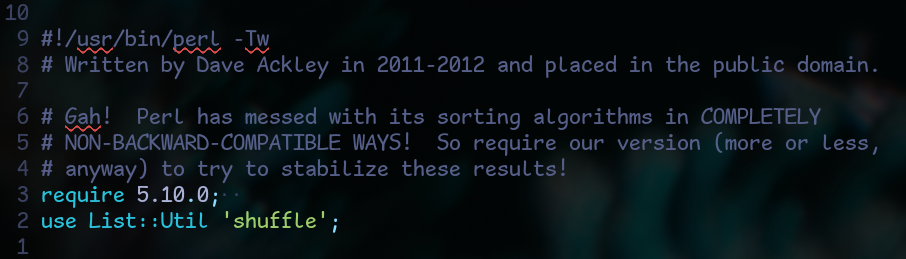
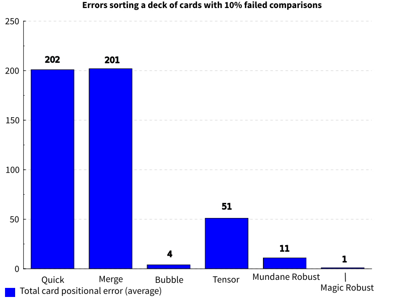

# Tensort 

Tensort is a family of sorting algorithms that are tunable to adjust to the
priorities of the task at hand.

This project started as an exploration of what a sorting algorithm that
prioritizes robustness might look like. As such it also describes and provides
implementations of Robustsort, a group of Tensort variants designed for
robustness in conditions described in David H. Ackley's
[Beyond Efficiency](https://www.cs.unm.edu/~ackley/be-201301131528.pdf).

Simply put, Tensort takes an input list, transforms the list into a
multi-dimensional tensor field, then transforms that tensor field back into a
sorted list. These transformations provide opportunities to increase redundancy
for improved robustness and can be leveraged to include any further processing
we wish to do on the elements.

<figure>
    
    <figcaption><i>
        Read on for the full data, or 
        <a href="#comparing-it-all">
            click here to jump to the comparison section for spoilers
        </a>
    </i></figcaption>
</figure>

## Table of Contents

- [Introduction](#introduction)
  - [Inspiration](#inspiration)
  - [Why?](#why)
  - [But why would anyone care about this in the first
     place?](#but-why-would-anyone-care-about-this-in-the-first-place)
  - [Why Haskell?](#why-haskell)
  - [What's a tensor?](#whats-a-tensor)
- [Project structure](#project-structure)
- [Algorithms overview](#algorithms-overview)
  - [Tensort](#tensort)
    - [Preface](#preface)
    - [Structure](#structure)
    - [Algorithm](#algorithm)
    - [Benefits](#benefits)
    - [Logarithmic Bytesize](#logarithmic-bytesize)
  - [Robustsort](#robustsort)
    - [Preface](#preface-1)
    - [Overview](#overview)
    - [Examining Bubblesort](#examining-bubblesort)
    - [Rotationsort](#rotationsort)
    - [Introducing Supersort](#introducing-supersort)
    - [Permutationsort](#permutationsort)
    - [Supersort Adjudication](#supersort-adjudication)
    - [Recursion](#recursion)
  - [Magicsort](#magicsort)
    - [Magic Robustsort sub-algorithm
       alterations](#magic-robustsort-sub-algorithm-alterations)
- [Comparing it all](#comparing-it-all)
- [Library](#library)
- [Development Environment](#development-environment)
- [Contact](#contact)
- [Thank you](#thank-you)

## Introduction

### Inspiration

  - [Beyond Efficiency](https://www.cs.unm.edu/~ackley/be-201301131528.pdf) by
  [David H. Ackley](https://livingcomputation.com/)

  - [Beyond Efficiency by Dave Ackley](https://futureofcoding.org/episodes/070)
  by Future of Coding ([Lu Wilson](https://www.todepond.com/),
  [Jimmy Miller](https://jimmyhmiller.github.io/),
  [Ivan Reese](https://ivanish.ca/))

### Why?

Because near the end of
[that podcast episode](https://futureofcoding.org/episodes/070),
[Ivan](https://ivanish.ca/) said "Why are we comparing Bubblesort versus
Quicksort and Mergesort? Well, because no one's made Robustsort yet."

And I thought, "Why not?"

### But why would anyone care about this in the first place?

Being adaptable to different scenarios, a tunable sorting algorithm has many
potential applications. This README will focus on robustness in sorting.

[Ackley](https://www.cs.unm.edu/~ackley/be-201301131528.pdf) has compelling
things to say about why prioritizing robustness is important and useful. I'd
highly recommend reading that paper!

Or listening to [this podcast](https://futureofcoding.org/episodes/070)!

If you want my elevator pitch, it's because we eventually want to build things
like [Dyson Spheres](https://en.wikipedia.org/wiki/Dyson_sphere). Doing so will
involve massively distributed systems that are constantly pelted by radiation.
In such circumstances, robustness is key.

Another example I like to consider is artificial cognition. When working
in a non-deterministic system (or a system so complex as to be considered
non-deterministic), it can be helpful to have systems in place to verify that
the answer we come to is valid.

Incidentally, while I was preparing for this project, we experienced
[the strongest solar storm to reach Earth in 2
decades](https://science.nasa.gov/science-research/heliophysics/how-nasa-tracked-the-most-intense-solar-storm-in-decades/).
I don't know for certain whether the solar activity caused any computer errors,
but we had some anomalies at work and certainly joked about them being caused
by the Sun.

Also during the same period,
[one of the Internet's root-servers glitched out for unexplained
reasons](https://arstechnica.com/security/2024/05/dns-glitch-that-threatened-internet-stability-fixed-cause-remains-unclear/).

As Ackley asserts, as a culture we have tended to prioritize correctness and
efficiency to the detriment of robustness. The rate of our technological
progression precludes us from continuing to do so.

### Why Haskell?

1. Tensort can involve a lot of recursion, which Haskell handles well

2. All the other benefits we get from using a purely functional language, such
as strict dependency management, which even the smartest among us sometimes
falter without:

<figure>
    
    <figcaption><i><a href="http://livingcomputation.com/robusort2.tar">
            Source
        </a></i></figcaption>
</figure>

      

3. [Obviously](https://www.youtube.com/shorts/LGZKXZQeEBg)

### What's a tensor?

If you want an in-depth explanation,
[Wikipedia](https://en.wikipedia.org/wiki/Tensor) is usually a good starting
place.

If you just want to understand Tensort, you can think of 'tensor' as a fancy
word for a multi-dimensional array.

Every tensor has a degree, which is the number of dimensions it has. A 0-degree
tensor is a scalar (like an integer), a 1-degree tensor is a vector (like a
list), a 2-degree tensor is a matrix, and so on.

Each dimension of a tensor has a rank, which can be thought of as the length of
that dimension. A tensor's shape can be described by another tensor that
denotes the ranks of each of its dimensions. For example. [1,2,3] is an
instance of a 1-degree tensor. Its single dimension is 3 elements long, so it
has a rank 3. Thus its shape is [3].

For another example, consider the following tensor which has the shape [3,2]:

    [[1,2,3],
     [4,5,6]]

Tensort transforms a list into a field of the highest-degree tensors possible
while giving its dimensions a specified maximum rank size to achieve the
densest possible cluster of short lists. This provides opportunities to add
processing tailored to suit the current goals while preserving time efficiency.

## Project structure

- `src/` contains the Tensort library
    
- `app/` contains the suite for comparing different sorting algorithms in terms
of robustness and time efficiency (only in the benchmarking branch)

- `data/` contains benchmarking data

## Algorithms overview

This README assumes some general knowledge of basic sorting algoritms. If you
would like a refresher, I recommend
[this video](https://www.youtube.com/watch?v=kgBjXUE_Nwc) which touches on
Bubblesort and Mergesort, and
[this video](https://www.youtube.com/watch?v=XE4VP_8Y0BU) which discusses
Quicksort.

It also assumes you've read
[Beyond Efficiency](https://www.cs.unm.edu/~ackley/be-201301131528.pdf) by
David H. Ackley. Go read it! It's short!

Please note that we will discuss a few algorithms that I've either made up or
am just not familiar with by other names. If any of these algorithms have
previously been named, please [let me know](#contact). Prior to this project I
really only had a rudimentary understanding of Insertionsort, Quicksort,
Mergesort, Bubblesort and Bogosort, so it's entirely possible that I've
reinvented a few things that already exist.

It may be helpful to note that this project was originally undertaken in an
endeavor to come up with a solution naively, for the exercise, before
researching other algorithms built to tackle the same problem. I did very
briefly check out Ackley's [Demon Horde
Sort](https://www.youtube.com/watch?v=helScS3coAE&t=260s), but only enough
(about 5 seconds of that video) to verify that it is different from this
algorithm. I've been purposefully avoiding learning much about Demon
Horde Sort before publishing v1.0.0.0 of this package, but Ackley is way
smarter than me so if you do actually want a real, professional approach to
robust sorting, Demon Horde Sort is likely the place to look.

The algorithms used here that I have made up or renamed are, in order of
introduction, Tensort, Robustsort, Rotationsort, Permutationsort, and
Magicsort.

I will also be joined by the spirit of Sir Michael Caine, who is here for two
reasons. One is to keep an eye on me and make sure I don't go too overboard.
More importantly, he's here as a bit of insurance to make sure you've read
[Beyond Efficiency](https://www.cs.unm.edu/~ackley/be-201301131528.pdf). You
can think of him as my version of the M&M's on Van Halen's concert
rider ([the most famously robust rider in rock
history](https://en.wikipedia.org/wiki/Van_Halen#Contract_riders)). If you
can't figure out why he's here, especially by the end of this README, go back
and re-read the paper!

Alright, let's get started! Ready, Sir Michael?

<figure>
    
    <figcaption><i><a href="https://www.imdb.com/name/nm0000323/mediaviewer/rm1782683648/">
            Source
        </a></i></figcaption>
</figure>

### Tensort

#### Preface

Tensort is my original attempt to write the most robust sorting algorithm
possible with O(n log n) average time efficiency while avoiding anything that
Ackley might consider a "cheap hack." Starting out, my hope was that it would
be, if not competitive with Bubblesort in robustness, at least a major
improvement over Quicksort and Mergesort.

After settling on this algorithm, I looked into several other sorting
algorithms for comparison and found a few that have some similarities with
Tensort - notably Blocksort, Bucketsort, and Patiencesort. If you are familiar
with these algorithms, you may recognize that they each have a structure that
aids in understanding them.

Tensort uses an underlying structure as well. We will discuss this structure 
before going over the algorithm's actual steps. If this doesn't make sense yet,
fear not!

#### Structure

  - Bit <- Element of the list to be sorted

  - Byte <- List of Bits

  - Bytesize <- Maximum length of a Byte

  - Tensor <- Tuple of a Register list and a Memory list

  - Memory <- List of Bytes or other Tensors contained in the current Tensor

  - Register <- List of Records, each Record referencing one Byte or Tensor
    in Memory

  - Record <- Tuple of the Address and a copy of the TopBit of the referenced
    Byte or Tensor

  - Address <- Pointer to a Byte or Tensor in Memory

  - TopBit <- Value of the Bit at the top of the stack in a Byte or Tensor

  - TensorStack <- A top-level Tensor along with all the Bits, Bytes, and
    Tensors contained within it. Structurally equivalent to a Tensor

  - TopRegister <- List of Records that is built after all Tensors are built.
    Each Record references one TensorStack. Structurally equivalent to a
    Register

  - SubAlgorithm <- The sorting sub-algorithm used at various stages

In Tensort, the smallest unit of information is a Bit. Each Bit stores one
element of the list to be sorted. A group of Bits is known as a Byte.

A Byte is a list of Bits. The maximum length of a Byte (known as the Bytesize)
is set according to an argument passed to Tensort. This Bytesize can also be
thought of as the maximum rank (not degree) of a tensor in Tensort.
Ideally, all Bytes will be of maximum length until the final steps of Tensort.
Several Bytes are grouped together in a Tensor.

A Tensor is a tuple with two elements: Register and Memory.

Memory is the second element in a Tensor tuple. It is a list of Bytes or
other Tensors. The maximum length of this Memory list is equal to the Bytesize.

A Register is the first element in a Tensor tuple. It is a list of Records,
each of which has an Address pointing to an element in its Tensor's Memory
and a copy of the TopBit in the referenced element.

Each Record is a simplification of a Byte or Tensor in a Tensor's memory. It
is a tuple comprised of an Address and a TopBit

The Address of a Record is an integer representing the index of the referenced
Byte or Tensor in its containing Tensor's memory

The TopBit of a Byte (which is copied into the Byte's referencing Record) is
the Bit at the end of the Byte list. If everything functions correctly, this
will be the highest value Bit in the Byte.

The TopBit of a Tensor (which is copied into the Tensor's referencing Record)
is the TopBit of the Byte referenced by the Record at the end of the Register
list of the Tensor referenced by the Record at the end of the Register list of
the Tensor... and so on until the original (containing) Tensor is reached. If 
everything functions correctly, this TopBit will be the highest value Bit in
the Byte.

A TensorStack is a top-level Tensor (i.e. a Tensor not contained within another
Tensor) along with all the Bits, Bytes, and Tensors it contains. Once the
Tensors are fully built, the total number of TensorStacks will be equal to (or
sometimes less than) the Bytesize, but before that point there will be many
more TensorStacks.

Once all Tensors are built, a TopRegister is assembled as a list of Records,
each Record referencing one TensorStack.

The sorting SubAlgorithm will be used any time we sort something within
Tensort. The choice of this SubAlgorithm is very important. For reasons that
will become clear soon, the SubAlgorithm for Standard Tensort will be
Bubblesort, but the major part of Tensort's tunability is the ability to
substitute another sorting algorithm based on current priorities.

Now, on to the algorithm!

#### Algorithm

The first step in Tensort is to randomize the input list. I'll explain why we
do this in more detail later - for now just know that it's easier for Tensort
to make mistakes when the list is already nearly sorted.

  1. Randomize the input list of Bits.

  2. Assemble Bytes by grouping the Bits into lists of lengths equal to the
     Bytesize, then sorting the Bits in each Byte using the SubAlgorithm. After
     this, we will do no more write operations on the Bits until the final
     steps. Instead, we will make copies of the Bits and sort the copies
     alongside their pointers.

  3. Assemble TensorStacks by creating Tensors from the Bytes:
        <ol>
            <li>
                i. Group the Bytes together in Memory lists of Bytesize length.
            </li>
            <li>ii. Assign each Memory to a newly-created Tensor.</li>
            <li>
                iii. For each Tensor, make Records for each Byte in its Memory
                     by combining the Byte's index in Memory list with a copy
                     of its TopBit.
            </li>
            <li>
                iv. Group the Records for each Tensor together and form them 
                    into their Tensor's Register list.
            </li>
            <li>
                v. Sort the Records in each Register list in order of their
                   TopBits.
            </li>
        </ol>

  4. Reduce the number of TensorStacks by creating a new layer of Tensors from
       the Tensors created in Step 3:
        <ol>
            <li>
                i. Group the first layer of Tensors together in Memory lists of
                   Bytesize length.
            </li>
            <li>ii. Assign each Memory to a newly-created Tensor.</li>
            <li>
                iii. For each newly-created Tensor, make Records for each
                     Tensor in its Memory by combining the enclosed Tensor's
                     index in the Memory list with a copy of its TopBit.
            </li>
            <li>
                iv. Group the Records for each newly-created Tensor together
                    and form them into their Tensor's Register list.
            </li>
            <li>
                v. Sort each Register list in order of its Records' TopBits.
            </li>
        </ol>

  5. Continue in the same manner as in Step 4 until the number of TensorStacks
     is equal to or less than the Bytesize.

  6. Assemble a TopRegister by making Records from the Top Bits of each
     TensorStack and sorting the Records.

  7. Remove the TopBit from the top Byte in the top TensorStack and add it to
     the final Sorted List. If the top Byte has more than one Bit in it still,
     re-sort the Byte for good measure

  8. If the top Byte in the top TensorStack is empty:
      <ol>
          <li>
              i. Remove the Record that points to the top Byte from its
                 containing Tensor's Register.
          </li>
          <li>
              ii. If the Tensor containing that byte is empty, remove the
                  Record that points to that Tensor from its containing
                  Tensor's Register. Do this recursively until finding a Tensor
                  that is not empty or the top of the TensorStack is reached.
          </li>
          <li>
              iii. If the entire TensorStack is empty of Bits, remove its
                   Record from the TopRegister.
         </li>
          <li>
              iv. If all TensorStacks are empty of Bits, return the final
                  Sorted List. Otherwise, re-sort the TopRegister.
          </li>
      </ol>

  9. Otherwise (i.e. the top Byte or a Tensor that contains it is not empty):
      <ol>
          <li>
              i. Update the top Byte's (or Tensor's) Record with its new
                 TopBit.
          </li>
          <li>
              ii. Re-sort the top Byte's (or Tensor's) containing Tensor's
                  Register.
          </li>
          <li>
              iii. Jump up a level to the Tensor that contains that Tensor,
                   update the containing Tensor's Record with its new TopBit,
                   and re-sort its Register. Do this recursively until the
                   whole TensorStack is rebalanced.
          </li>
          <li>
              iv. Update the TensorStack's Record in the TopRegister with its
                  new TopBit.
          </li>
          <li>v. Re-sort the TopRegister.</li>
      </ol>

  10. Repeat Steps 7-9 until the final Sorted List is returned.

Now that we know all the steps, it's easier to see why we randomize the list
as the beginning step. This way, if the list is already nearly sorted, values
close to each other don't get stuck under each other in their Byte. Ideally, we
want the top Bits in all the TensorStacks to be close to the same value.

To illustrate, say that we're using a Bytesize of 4 and the first four Bits
in a list of 1,000,000 to be sorted are 121, 122, 123, and 124. If we don't
randomize the list, these 4 Bits get grouped together in the first Byte.

That's all well and good if everything performs as expected, but if something
unexpected happens during an operation where we intend to add 124 to the final
list and we add a different Bit instead, three of the best Bits to have
mistakenly added (121, 122, and 123) are impossible to have been selected.

#### Benefits

Tensort is designed to be adaptable for different purposes. The core mechanic
in Tensort is the breaking down of the input into smaller pieces along many
dimensions to sort the smaller pieces. Once we understand the overall
structure of Tensort, we can design a SubAlgorithm (and Bytesize) to suit our
needs.

Standard Tensort leverages the robustness of Bubblesort while reducing runtime
by never Bubblesorting the entire input at once.

We are able to do this because A) Bubblesort is very good at making sure the
last element is in the final position of a list, and B) at each step in Tensort
the only element we *really* care about is the last element of a given list (or
to look at it another way, the TopBit of a given Tensor).

#### Logarithmic Bytesize

When using standard Tensort (i.e. using Bubblesort as the SubAlgoritm), as the
Bytesize approaches 1, the length of the input list, or the square root of the
number of elements in the input list, its average time efficiency approaches
O(n^2).

Standard Tensort is most time efficient when the Bytesize is close to the
natural log of the number of elements in the input list. A logarithmic Bytesize
is likely to be ideal for most use cases of standard Tensort.

-------

Alright! We now have a sorting algorithm absent of cheap hacks that both
maintains O(n log n) average time efficiency and is relatively robust. I'm
pretty happy with that!

But now that we understand Tensort's basic structure, let's tune it for even
more robustness!

<figure>
    
    <figcaption><i><a href="https://www.imdb.com/name/nm0000323/mediaviewer/rm3619586816/">
            Source
        </a></i></figcaption>
</figure>

### Robustsort

#### Preface

In Beyond Efficiency, Ackley augmented Mergesort and Quicksort with what he
called "cheap hacks" in order to give them a boost in robustness in an attempt
to get them to compare with Bubblesort. This amounted to adding a quorum system
to the unpredictable comparison operator and choosing the most-agreed-upon
answer.

I agree that adding a quorum for the unpredictable comparison operator is at
least a post-hoc solution to a known problem. Instead of retrying a specific
component again because we know it to be unpredictable, let's build redundancy
into the system at the (sub-)algorithmic level. A simple way to do this is by
asking different components the same question and see if they agree.

Robustsort is my attempt to make the most robust sorting algorithm possible,
utilizing some solution-checking on the (sub-)algorithmic level while still:

  - Keeping to O(n log n) average time efficiency

  - Never re-running a sub-algorithm that is expected to act deterministicly
    on the same arguments looking for a non-deterministic result (i.e. expect
    that if a component gives a wrong answer, running it again the same way
    won't somehow yield a right answer)

  - Using a minimal number of different sub-algorithms (i.e. don't just use
    every sorting algorithm that comes to mind and compare all their results)

With those ground rules in place, let's get to Robustsort!

#### Overview

Once we have Tensort in our toolbox, the road to Robustsort is not long.

Robustsort is a potentially recursive version of Tensort, but first we'll look
at the basic variant: a 3-Bit Tensort with a custom SubAlgorithm that compares
other sub-algorithms. For convenience, we will call this custom SubAlgorithm
Supersort. We use a 3-Bit Tensort here because there's something magical that
happens around the number 3.

Robust sorting algorithms tend to be slow. Bubblesort, for example, having an
average time efficiency of O(n^2), is practically glacial compared with
Quicksort and Mergesort (which both have an average of O(n log n)).

Here's the trick though: with small numbers the difference between these values
is minimal. For example, when n=4, Mergesort will make 6 comparisons, while
Bubblesort will make 12. A Byte holding 4 Bits is both small enough to run the
Bubblesort quickly and large enough to allow multiple opportunities for a
mistake to be corrected.

In Robustsort, we choose a Bytesize of 3 because a list of 3 Bits has some
special properties. For one thing, sorting at this length greatly reduces the
time it takes to run our slow-but-robust algorithms. For example, at this size,
Bubblesort will make only 6 comparisons. Mergesort still makes 6 as well.

Furthermore, when making a mistake while sorting a list of 3 elements, the
mistake will displace an element by only 1 or 2 positions at most, no matter
which algorithm is used.

This is all to say that using a 3-Bit Bytesize allows us to have our pick of
sub-algorithms to compare with!

#### Examining Bubblesort

Before moving further, let's talk a little about Bubblesort and why we're
using it in our SubAlgorithm.

We've said before that Bubblesort is likely to put the last element in the
correct position of a list. Let's examine this in the context of Bubblesorting
a 3-element list.

I ran Bubblesort 1000 times on random permutations of [1,2,3] using a faulty
comparator that gives a random result 10% of the time when comparing two
elements. Here is how often each outcome was returned:

    94.1% <- [1,2,3]

    2.5% <- [1,3,2]

    3.0% <- [2,1,3]

    0.0% <- [2,3,1]

    0.4% <- [3,1,2]

    0.0% <- [3,2,1]

In these results, 97.1% of the time the TopBit was returned in the correct
position. The only results returned in which the TopBit was not in the correct
position were [1,3,2] and [3,1,2].

#### Rotationsort

When choosing an algorithm to compare with Bubblesort, we want something with
substantially different logic, for the sake of robustness. We do, however, want
something similar to Bubblesort in that it compares our elements multiple
times. And as mentioned above, the element that is most important to our
sorting is the last (i.e. highest value) element, by a large degree.

In terms of the probability of different outcomes, if our algorithm returns
an incorrect result, we want that result to be different than what Bubblesort
is likely to return.

Keeping these priorities in mind, the algorithm we will use to compare with
Bubblesort is Rotationsort.

The steps in Rotationsort are relatively simple:

  1. Compare the last element with the first element. If the last element is
     smaller, move it to the beginning of the list and repeat Step 1.

  2. Compare the first two elements. If the second element is smaller, move it
     to the beginning of the list and return to Step 1.

  3. Compare the second and third elements. If the third element is smaller,
     move it to the beginning of the list and return to Step 1.

  4. Continue on in this fashion until the end of the list is reached.

  5. Return the sorted list.

The version we use here will be a Reverse Rotationsort. Instead of starting at
the beginning of the list and working forward, moving lower-value elements back
to the beginning, a Reverse Rotationsort starts at the end and works backward, 
moving higher-value elements to the end. We do this because it yields a more
favorable spread of results to combine with Bubblesort than a Forward
Rotationsort does.

Here are the results of running (Reverse) Rotationsort 1000 times on random
permutations of [1,2,3] using a faulty comparator that gives a random result
10% of the time when comparing two elements:

    95.3% <- [1,2,3]

    1.5% <- [1,3,2]

    3.1% <- [2,1,3]

    0.1% <- [2,3,1]

    0.0% <- [3,1,2]

    0.0% <- [3,2,1]

In these results, 98.4% of the time the TopBit was returned in the correct
position The only results returned in which the TopBit was not in the correct
position were [1,3,2] and [2,3,1].

You may notice that one of the two problematic results returned ([2,3,1]) was
never returned by Bubblesort. In turn, Bubblesort returned one result ([3,1,2])
that Rotationsort did not. This doesn't mean that these algorithms will never
return these results, but the chances of them doing so are very low.

Overall, there is a modest probability (about 0.04% according to these results)
that Bubblesort and Rotationsort will agree on [1,3,2] as the result, but it is
very unlikely that they will agree on any other result that does not have the
Top Bit in the correct position.

##### A note about [1,3,2]

You may notice that the most common problematic result returned by both
Bubblesort and Rotationsort is [1,3,2]. Wouldn't it be better to compare with
an algorithm that doesn't return this result as often?

It would. It seems, however, that any sorting algorithm which has [1,2,3] and
[2,1,3] as its most common results also has [1,3,2] as its third most common.
This may be inevitable due to [2,1,3] and [1,3,2] being only one adjacent
element swap away from [1,2,3].

I came up with Rotationsort while attempting to discover a robust sorting
algorithm that prioritizes non-adjacent swaps (compare
[Circlesort](https://youtu.be/wqibJMG42Ik?feature=shared&t=222)). If anyone
finds an algorithm that is comparable with Bubblesort and Rotationsort in terms
of both accuracy in determining the TopBit and adhering to the general rules of
this project while returning something besides [1,3,2] as its third most common
result, [I'd love to hear about it](#contact)!

<figure>
    
    <figcaption><i><a 
        href="https://www.imdb.com/name/nm0000323/mediaviewer/rm4040654848/">
            Source
        </a></i></figcaption>
</figure>

#### Introducing Supersort

Supersort is a SubAlgorithm that compares the results of two different
sorting algorithms, in our case Bubblesort and Rotationsort. If both
algorithms agree on the result, that result is used.

Looking at our analysis of Bubblesort and Rotationsort, we can
approximate the chances that they will agree in similar conditions:

    ~89.68% <- Agree Correctly

    ~10.19% <- Disagree

    ~0.09% <- Agree Incorrectly - TopBit correct

    ~0.04% <- Agree Incorectly - TopBit incorrect

Hey, that's pretty good! If they agree, then return the results from
Rotationsort because if for some reason the module that compares the full Bytes
is also faulty (outside the scope of these benchmarks), Rotationsort is more
likely to have an accurate result.

Around 10% of the time, these sub-algorithms will disagree with each other. If
this happens, we run our third sub-algorithm: Permutationsort.

#### Permutationsort

Permutationsort is a simple, brute-force sorting algorithm.

As a first step we generate all the different ways the elements could possibly
be arranged in the list. Then we loop over this list of permutations until we
find one that is in the right order.

We check if a permutation is in the right order by comparing the first two
elements. If the first element is greater, we move to the next permutation.
Otherwise (i.e. the first element is smaller), we compare the next two
elements, and so on until we either find two elements that are out of order or
we reach the end of the list, confirming that the list is in order.

Permutationsort is a good choice for our adjudication algorithm because A) the
spread of outcomes is favorable for our needs and B) it uses logic that is
completely different from Bubblesort and Rotationsort. Using different manners
of reasoning to reach an agreed-upon answer increases the robustness of a
system.

Here are the results of running Permutationsort 1000 times on random
permutations of [1,2,3] using a faulty comparator that gives a random result
10% of the time:

    81.9% <- [1,2,3]

    4.1% <- [2,1,3]

    4.5% <- [3,1,2]

    5.3% <- [1,3,2]

    3.4% <- [2,3,1]

    0.8% <- [3,2,1]

In these cases, 86% of the time the Top Bit was in the correct position.
The least likely outcome is a reverse-sorted Byte and the other possible
incorrect outcomes are in approximately even distribution with each other.

#### Supersort Adjudication

Supposing that our results from Bubblesort and Rotationsort disagree and we now
have our result from Permutationsort, how do we choose which to use?

First we check to see whether the result from Permutationsort agrees with the
results from either Bubblesort or Rotationsort. To keep things simple, let's
just look at the raw chances that Permutationsort will agree on results with
Bubblesort or Rotationsort.

Permutationsort and Bubblesort:

    ~77.07% <- Agree Correctly

    ~28.13% <- Disagree

    ~0.14% <- Agree Incorrectly - TopBit correct

    ~0.12% <- Agree Incorectly - TopBit incorrect

Permutationsort and Rotationsort:

    ~78.05% <- Agree Correctly

    ~21.74% <- Disagree

    ~0.14% <- Agree Incorrectly - TopBit correct

    ~0.07% <- Agree Incorectly - TopBit incorrect

If Permutationsort agrees with either Bubblesort or Rotationsort, then it's
easy - just use that result!

According to these results, Permutationsort is likely to disagree with both
Bubblesort and Rotationsort about 6.12% of the time if all three are run
independently. In practice, if Permutationsort is run at all it has a greater
chance than that because in order to reach that point, first either Bubblesort
or Rotationsort must have sorted the list incorrectly, which makes them less
likely to agree with Permutationsort.

In any case, if all three sub-algorithms disagree, use the results from
Rotationsort.

#### Recursion

You'll remember that our standard Tensort uses a logarithmic Bytesize. Our base
Robustsort uses a Bytesize of 3, but we can use a logarithmic Bytesize by
adding recursion.

<figure>
    
    <figcaption><i><a href="https://www.imdb.com/name/nm0000323/mediaviewer/rm1461852929/">
            Source
        </a></i></figcaption>
</figure>

      

Let's take our base Robustsort example above and make it recursive.

First, instead of using a 3-Bit Bytesize, we will use a logarithmic Bytesize.
Then, instead of using our Supersort directly as our SubAlgorithm, we will use
Robustsort itself to sort the records.

At the base case, this Robustsort will have a Bytesize of 3. If the logarithmic
Bytesize of the input list is greater than 27, then the SubAlgorithm of the
top-level Robustsort will be a recursive Robustsort with a logarithmic
Bytesize.

The number 27 is chosen because we want a number that has a natural log that is
close to 3 (27's is about 3.3) and since 3 ^ 3 = 27, it is easy to sort lists
of 27 elements in groups of 3.

This recursive version of Robustsort is more tailored to large input lists (in
fact, it doesn't add another layer of recursion until the input list is is
longer than 500 billion elements), but differences can be noticed when sorting
smaller lists as well.

We now have a simple form of Robustsort: a potentially recursive Tensort with a
3-Bit base case using a Supersort adjudicating Bubblesort, Rotationsort, and
Permutationsort as its base SubAlgorithm.

Well that's pretty cool! But I wonder... can we make this more robust, if we
relax the rules just a little more?

Of course we can! And we will. To do so, we will replace Permutationsort with
another newly-named sorting algorithm: Magicsort!

### Magicsort

For our most robust iteration of Robustsort we will relax the requirement on
never re-running the same deterministic sub-algorithm in one specific context.
Magicsort is an algorithm that will re-run Permutationsort only if it disagrees
with an extremely reliable, theoretically non-deterministic algorithm - one
that's so good it's robust against logic itself...

<figure>
    
    <figcaption><i><a href="https://www.imdb.com/video/vi3757292825/">
            Source
        </a></i></figcaption>
</figure>

      

...[Bogosort!](https://www.youtube.com/watch?v=kgBjXUE_Nwc&t=583)

Magicsort simply runs both Permutationsort and Bogosort on the same input and
checks if they agree. If they do, the result is used and if not, both
algorithms are run again. This process is repeated until the two algorithms
agree on a result.

Magicsort is based on the notion that if you happen to pull the right answer
out of a hat once, it might be random chance, but if you do it twice, it might
just be magic!

Observant readers may have already deduced that Permutationsort functions
nearly identically to Bogosort. Here are the results of running Bogosort 1000
times on random permutations of [1,2,3] using a faulty comparator that gives a
random result 10% of the time:

    81.3% <- [1,2,3]

    3.0% <- [2,1,3]

    3.8% <- [3,1,2]

    5.8% <- [1,3,2]

    5.7% <- [2,3,1]

    0.4% <- [3,2,1]

In these cases, 84.3% of the time the Top Bit was in the correct position.
Even though both Bogosort and Permutationsort were ran with the same random
seeds, they gave slightly different results because their methodology is
slightly different. Still, the least likely outcome for Bogosort is also a
reverse-sorted Byte and the other possible incorrect outcomes are in
approximately even distribution with each other.

Here are the results of running Magicsort 1000 times on random permutations of
[1,2,3] using a faulty comparator that gives a random result 10% of the time
when comparing two elements:

    ~94.0% <- [1,2,3] (Correct)

    ~1.5% <- [2,1,3] (Correct TopBit)

    ~1.4% <- [1,3,2] (Incorrect)

    ~1.5% <- [3,1,2] (Incorrect)

    ~1.5% <- [2,3,1] (Incorrect)

    ~0.1% <- [3,2,1] (Reverse)

In total, 95.5% of the time we got the TopBit in the correct position, 0.1% of
the time we got a reverse-sorted list, and the other results are in almost
exactly even distribution with each other.

You may note that [1,3,2] (the most common problematic result from earlier)
was second least common result. This is likely a fluke, but it's still pretty
neat.

The downside here is that Magisort can take a long time to run. Thankfully,
Magicsort will only be run in our algorithm if Bubblesort and Rotationsort
disagree on an answer, and even then it only has 3 elements to sort. Overall,
the Robustsort we're building that uses Magicsort will still have an average of
O(n log n) time efficiency.

#### Magic Robustsort SubAlgorithm alterations

We will also make a few adjustments to our SubAlgorithms for Magic Robustsort.

First, we will make our Reverse Rotationsort ambidextrous. This means that after each
forward comparison (with a chance to rotate the smaller element to the front
of the list), we will make a backward comparison (with a chance to rotate the
larger element to the back of the list).

Second, we will replace Bubblesort with a Forward Ambidextrous Rotationsort.

Finally, we will adjust our adjudication scheme, taking the Forward Ambidextrous
Rotationsort's results if there is no agreement within Supersort.

### A note on Robustsort and Bogosort

It is perfectly valid to use Bogosort in place of Permutationsort in
Robustsort's standard Supersort SubAlgorithm. It may even be argued that doing
so is more robust, since Bogosort barely even relies on logic. Here are some
considerations to keep in mind:

  - Bogosort by nature re-runs on the same input multiple times. Depending on
      viewpoint, this either violates the original rules I set forward or is a
      major benefit.

  - In testing, Robustsort with Bogosort tends to give more robust results,
      though Robustsort with Permutationsort tends to run slightly faster.

  - Permutationsort uses additional space due to computing all possible
      permutations of the input and storing them in a list.

  - Bogosort could theoretically run forever without returning a result, even
      when no errors occur.

## Comparing it all

Now let's take a look at how everything compares. Here is a graph showing the
benchmarking results for average error score and total runtime for our
algorithms:

<figure>
    
</figure>

As shown above, when sorting a randomly shuffled deck of cards, Quicksort makes
202 positional errors, Mergesort makes 201, Bubblesort makes 4, Logarithmic
Tensort makes 51, Basic Mundane Robustsort makes 11, and Basic Magic Robustsort
makes only 1!

I'll note here that the results weren't quite as dramatic when adding in a
stuck comparator (which gives the same answer it gave previously 50% of the
time) in addition to the wonky one (which gives a random answer 10% of the time)
. Our Recursive Magic Robustsort made an average of 292 positional errors,
which well outperformed Mergesort's 747, but was still behind Bubblesort's 97.

More benchmarking data can be found in the `data/` directory. Before we wrap
up, let's look at the runtimes and average error scores (with a wonky
comparator) for the largest input list (2048) we benchmarked before removing
Bubblesort from the comparisons:

    ----------------------------------------------------------
     Algorithm    | Time            | Score    | n = 2048
     Mergesort    | 0.002706653s    | 319199   |
     Quicksort    | 0.002206037s    | 269252   |
     Bubblesort   | 67.229769894s   | 707      |
     TensortBL    | 0.056649886s    | 34223    |
     RobustsortP  | 0.036861441s    | 21177    |
     RobustsortB  | 0.038692015s    | 18025    |
     RobustsortM  | 0.046679795s    | 3255     |
     RobustsortRP | 0.229615609s    | 15254    |
     RobustsortRB | 0.22648706s     | 10147    |
     RobustsortRM | 0.249211013s    | 1824     |
    ----------------------------------------------------------

Well, there it is! I'm pretty happy with the results. What do you think, Sir
Michael?

<figure>
    
    <figcaption><i><a href="https://www.imdb.com/video/vi3792027161/">
            Source
        </a></i></figcaption>
</figure>

## Library

This package provides implementations of the following algorithms wrapped for
integer sorting:

  - Standard Logarithmic Tensort

  - Basic Robustsort with Permutationsort adjudicator

  - Basic Robustsort with Bogosort adjudicator

  - Basic Magic Robustsort

  - Recursive Robustsort with Permutationsort adjudicator

  - Recursive Robustsort with Bogosort adjudicator

  - Recursive Magic Robustsort

It also provides many more algorithms and helper functions wrapped for both Bit
and Record sorting so you can make your own Tensort variants!

Check the code in `src/` or the documentation on Hackage/Hoogle
for more details.

## Development Environment

This project is wrapped in a Nix Flake, so it's easy to hack on yourself!

Note that (unless otherwise specified) all instructions assume you are in the 
repository root, have Nix installed, and have entered the development shell.

### Entering the Dev Shell

Note that these instructions don't make the assumptions listed above

  * [Install Nix](https://nixos.org/download/)
  * [Enable Flakes](https://nixos.wiki/wiki/Flakes)
  * [Clone this repository](https://docs.github.com/en/repositories/creating-and-managing-repositories/cloning-a-repository)
  * Run `nix develop` in the repository root

### Run main test suite (QuickCheck)

  * Run `cabal test`

### Run DocTest

  * Run `cabal repl --with-compiler=doctest`

### Print Benchmarking Data

  * [Checkout to the 'benchmarking'
    branch](https://git-scm.com/docs/git-checkout)
  * Uncomment the desired benchmarking process(es) in `app/Main.hs`
  * Run `cabal run`

## Contact

Questions and feedback are welcome!

The easiest way to contact me is usually via
[LinkedIn](https://www.linkedin.com/in/kyle-beechly), or you can try
[email](mailto:tensort@kabeech.com).

## Thank you!

Thank you for reading! I've had so much fun working on this project. I hope
you've enjoyed our time and that you'll continue thinking about tunable sorting
and robustness in computing.

I'd like to send a special thank you to the following people:

  - [David H. Ackley](https://livingcomputation.com/), obviously

  - [Lu Wilson](https://www.todepond.com/),
  [Jimmy Miller](https://jimmyhmiller.github.io/), and
  [Ivan Reese](https://ivanish.ca/) of
  [Future of Coding](https://futureofcoding.org/) (Check it out! They do my
  favorite tech podcast)

  - The Haskell community at large, specifically the 
  [Haskell Subreddit](https://www.reddit.com/r/haskell/) and
  [Portland Has Skill](https://github.com/kabeech/portland-has-skill)

  - Countless family, friends, acquaintances, and strangers who've tolerated me
  blathering on about sorting algorithms over the past few months 💙
